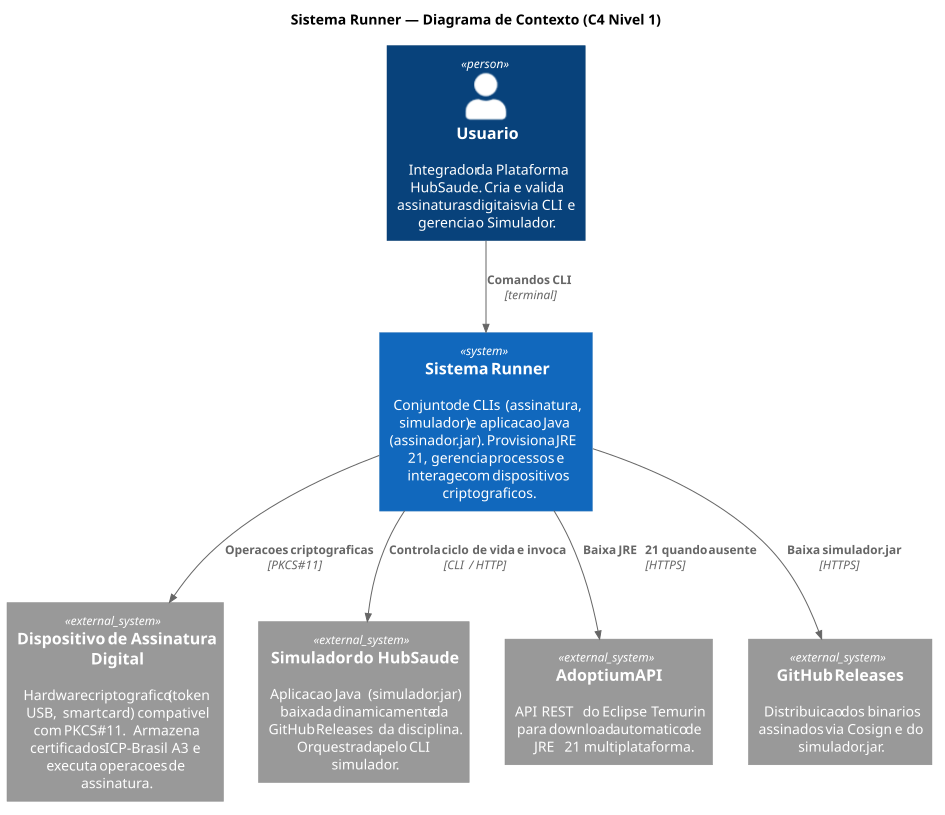
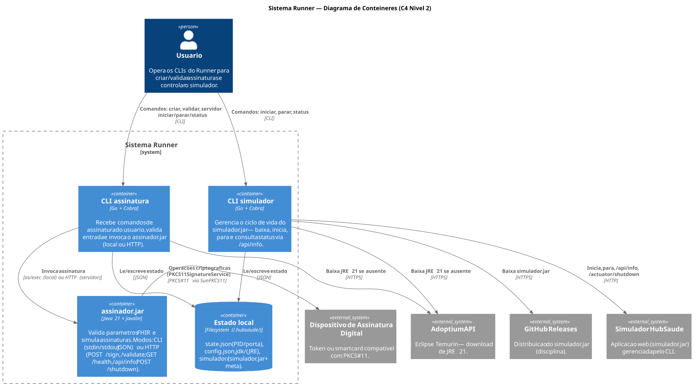

# Sistema Runner - Design

- O registro do design é organizado conforme o modelo C4. Consulte [C4 Model](https://c4model.com/) para detalhes.
- Diagramas empregam o PlantUML. Consulte [PlantUML](https://plantuml-documentation.readthedocs.io/en/latest/) para detalhes.
- Os arquivos-fonte ficam em [`diagramas/`](diagramas/) (`contexto.puml`, `conteineres.puml`).
- Scripts ([`diagramas/geraimagens.sh`](diagramas/geraimagens.sh) e [`diagramas/geraimagens.bat`](diagramas/geraimagens.bat)) automatizam a geração dos diagramas a partir dos arquivos `.puml`, produzindo SVG/PNG em `diagramas/imagens/`.

## 1. Diagrama de Contexto

Fonte: [`diagramas/contexto.puml`](diagramas/contexto.puml)

**Atores e Sistemas Externos:**

| Elemento | Tipo | Descrição |
|----------|------|-----------|
| Usuário | Ator | Integrador da Plataforma HubSaúde. Cria e valida assinaturas digitais via CLI e gerencia o Simulador |
| Dispositivo de Assinatura Digital | Sistema Externo | Hardware criptográfico (token USB, smart card) compatível com PKCS#11, que armazena certificados e executa operações de assinatura |
| Simulador do HubSaúde | Sistema Externo | Aplicação Java (`simulador.jar`) baixada dinamicamente da GitHub Releases da disciplina e orquestrada pelo CLI `simulador` |
| Adoptium API | Sistema Externo | API REST do Eclipse Temurin usada para download automático do JRE 21 multiplataforma quando ausente |
| GitHub Releases | Sistema Externo | Distribuição dos binários (assinados via Cosign) e do `simulador.jar` |

**Interações:**

| Origem | Destino | Protocolo | Descrição |
|--------|---------|-----------|-----------|
| Usuário | Sistema Runner | CLI (terminal) | Comandos de assinatura (criar, validar) e de gerenciamento do simulador |
| Sistema Runner | Dispositivo de Assinatura Digital | PKCS#11 | Operações criptográficas em token/smart card |
| Sistema Runner | Simulador do HubSaúde | CLI / HTTP | Controla o ciclo de vida e invoca o simulador |
| Sistema Runner | Adoptium API | HTTPS | Baixa o JRE 21 quando ausente |
| Sistema Runner | GitHub Releases | HTTPS | Baixa o `simulador.jar` |

## 2. Diagrama de Contêineres

Fonte: [`diagramas/conteineres.puml`](diagramas/conteineres.puml)

**Contêineres do Sistema Runner:**

| Contêiner | Tecnologia | Responsabilidade |
|-----------|-----------|------------------|
| CLI `assinatura` | Go + Cobra | Recebe comandos de assinatura do usuário, valida a entrada e invoca o `assinador.jar` (modo local ou HTTP) |
| CLI `simulador` | Go + Cobra | Gerencia o ciclo de vida do `simulador.jar` — baixa, inicia, para e consulta status via `/api/info` |
| `assinador.jar` | Java 21 + Javalin | Valida parâmetros FHIR e simula assinaturas. Modos: CLI (stdin/stdout JSON) ou HTTP (`POST /sign`, `POST /validate`; `GET /health`, `GET /api/info`; `POST /shutdown`) |
| Estado local | Filesystem (`~/.hubsaude/`) | `state.json` (PID/porta), `config.json`, `jdk/` (JRE), `simulador/` (`simulador.jar` + metadados) |

**Comunicação entre contêineres:**

| Origem | Destino | Protocolo | Descrição |
|--------|---------|-----------|-----------|
| Usuário | CLI `assinatura` | CLI | Comandos: `criar`, `validar`, `servidor iniciar/parar/status` |
| Usuário | CLI `simulador` | CLI | Comandos: `iniciar`, `parar`, `status` |
| CLI `assinatura` | `assinador.jar` | `os/exec` (local) ou HTTP (servidor) | Invocação direta ou requisição HTTP, conforme o modo de execução |
| CLI `assinatura` | Estado local | JSON | Lê/escreve estado (PID, porta, configuração) |
| CLI `simulador` | Simulador do HubSaúde | HTTP | Inicia, para (`/actuator/shutdown`) e monitora (`/api/info`) o simulador |
| CLI `simulador` | Estado local | JSON | Lê/escreve estado |
| CLI `simulador` | GitHub Releases | HTTPS | Baixa o `simulador.jar` |
| CLI `assinatura` / `simulador` | Adoptium API | HTTPS | Baixa o JRE 21 quando ausente |
| `assinador.jar` | Dispositivo Criptográfico | PKCS#11 (via SunPKCS11) | Operações criptográficas (`PKCS11SignatureService`) |
